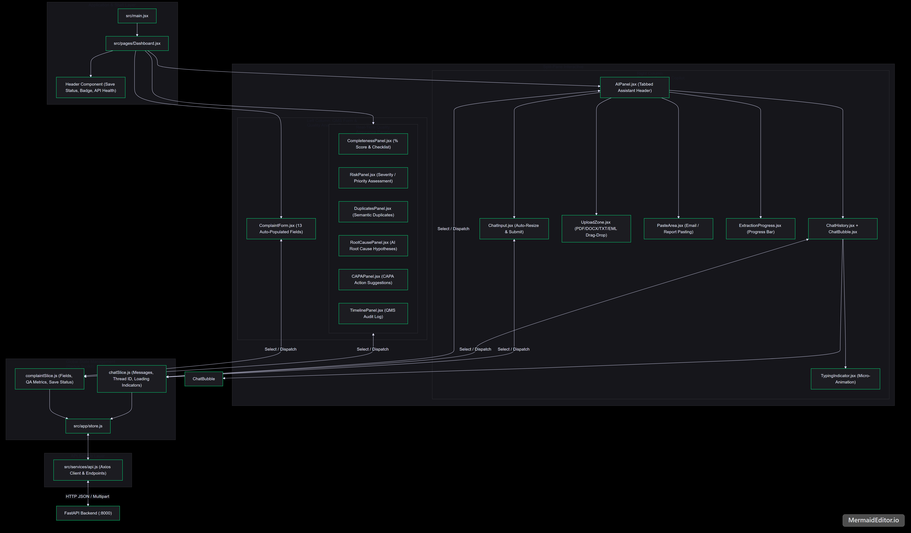
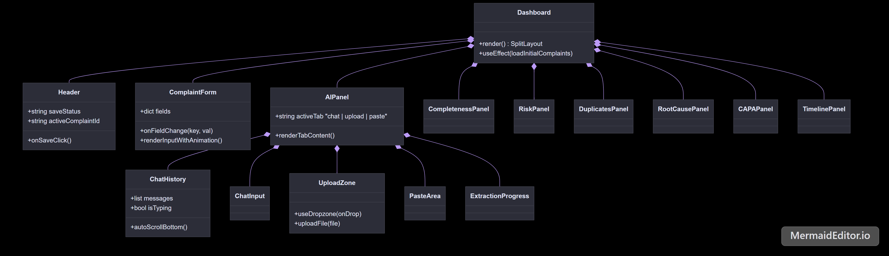
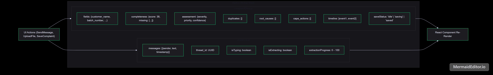
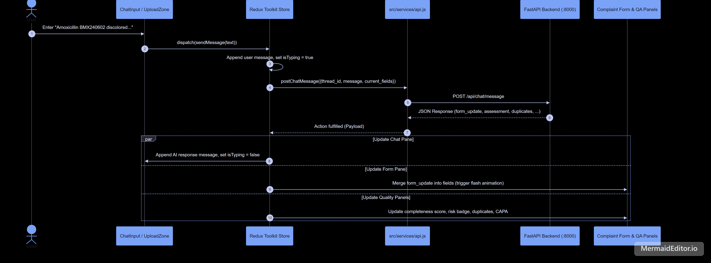
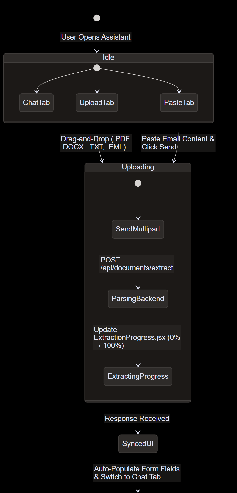

# AIVOA Frontend Architecture & Implementation Guide

> **Pharmaceutical API & FDF Quality Assurance Module — Frontend Subsystem**  
> Built with **React 18**, **Vite**, **Redux Toolkit**, **Axios**, **react-dropzone**, and **Vanilla CSS Design System**.

---

## 1. Executive Summary

The **AIVOA Frontend** is a responsive Single-Page Application (SPA) that transforms traditional quality assurance workflows into an intuitive **Conversational AI Copilot** experience. Built with **React 18** and **Redux Toolkit**, the interface synchronizes a ChatGPT-style conversational assistant with an enterprise-grade, auto-populating pharmaceutical complaint form and multi-dimensional QA analysis panels.

---

## 2. Component Composition Hierarchy

The UI is structured into modular, reusable components located in `src/components/`, organized by domain responsibility:

### 2.1 Directory & Component Responsibilities

| Component Directory | Files | Primary Responsibility |
| :--- | :--- | :--- |
| **`layout/`** | `Header.jsx` | Top navigation bar displaying application title, API connection status, current complaint ID badge, and the **Save Complaint** button. |
| **`form/`** | `ComplaintForm.jsx` | Renders all 13 standard pharmaceutical QMS fields (Customer, Product, Batch, Dates, Severity, etc.). Features visual highlight animations whenever a field is updated automatically by the AI. |
| **`assistant/`** | `AIPanel.jsx`, `ChatHistory.jsx`, `ChatBubble.jsx`, `ChatInput.jsx`, `UploadZone.jsx`, `PasteArea.jsx`, `ExtractionProgress.jsx`, `TypingIndicator.jsx` | Provides a full ChatGPT-style chat copilot, drag-and-drop file upload zone (`react-dropzone`), raw email paste modal, and animated extraction progress indicator. |
| **`panels/`** | `CompletenessPanel.jsx`, `RiskPanel.jsx`, `DuplicatesPanel.jsx`, `RootCausePanel.jsx`, `CAPAPanel.jsx`, `TimelinePanel.jsx` | Interactive QA widgets that visualize form completeness percentages, risk priority badges, duplicate complaint cards, AI root causes, CAPA checklists, and audit trails. |

---

## 3. Redux Toolkit State Management

State is centrally managed in `src/app/store.js` using **Redux Toolkit (RTK)**, partitioned into two distinct slices:

> [!NOTE]
> **Why Redux Toolkit?**  
> In a dual-pane conversational UI, updates from an AI chat response must simultaneously populate form fields, refresh completeness scores, update risk badges, check for duplicate records, and append audit events. Redux Toolkit ensures predictable, transactional state updates across all disconnected panes without prop drilling.

---

## 4. Real-Time Synchronization & Data Flow

When a user submits natural language text or uploads an inspection document, the frontend coordinates a synchronized multi-pane update:

---

## 5. Document Upload & Email Paste Workflow

AIVOA supports frictionless intake of existing quality documents via `UploadZone.jsx` and `PasteArea.jsx`:

1. **File Drop / Click Upload**: Uses `react-dropzone` to accept `.pdf`, `.docx`, `.txt`, and `.eml` files up to 10 MB.
2. **Progress Visualizer**: Renders `ExtractionProgress.jsx`, providing immediate visual feedback during backend document parsing and Llama-3.3-70B extraction.
3. **Email Paste Tab**: Allows QA operators to paste unstructured customer emails directly; the text is wrapped and submitted to `/api/documents/extract` as a virtual document.

---

## 6. Styling, Design System & Aesthetics (`index.css`)

The frontend styling is implemented via a curated **Vanilla CSS Design System** (`src/styles/index.css`) designed to evoke a modern, high-tech pharmaceutical quality suite:

* **Curated Color Palette**:
  * **Primary Accent**: Clean Indigo (`#4F46E5`) and Slate Teal for interactive elements.
  * **Severity Indicators**: Dedicated color tokens for regulatory risk (`#EF4444` Critical Red, `#F59E0B` Major Amber, `#10B981` Minor Green).
* **Typography**: Powered by **Google Inter** for crisp, highly readable data presentation across high-density form grids.
* **Micro-Animations & Feedback**:
  * **Field Highlight Animation**: When an AI response updates a field in `ComplaintForm.jsx`, a subtle CSS keyframe glow animation highlights the changed input box so operators instantly see what was modified.
  * **Glassmorphic Cards**: Panels use subtle borders, rounded radii, and shadow elevations to visually separate QA insights from raw input controls.
* **Vite Proxy Configuration**: `vite.config.js` routes `/api` requests seamlessly to `http://localhost:8000` during development, eliminating CORS bottlenecks.
